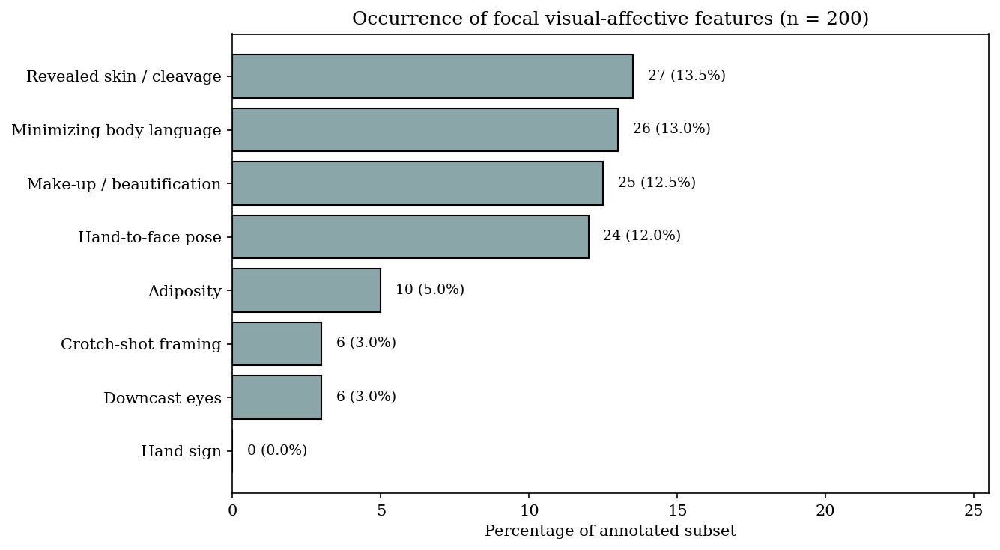
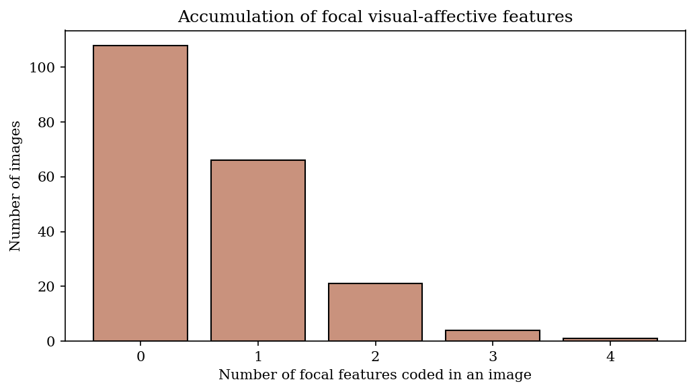
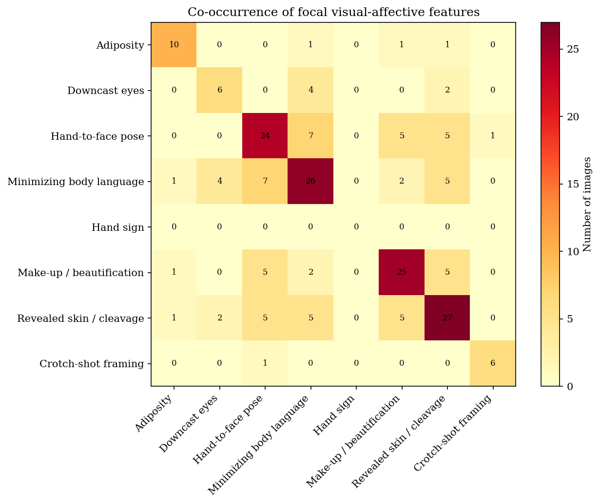
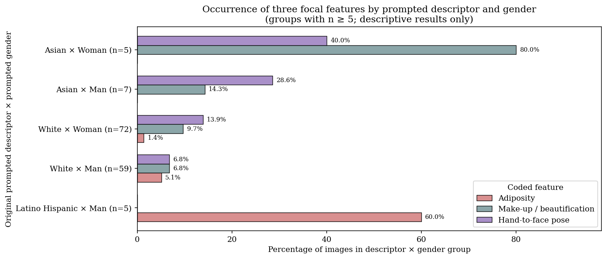

# Qualitative Results and Supporting Visualisations

This page provides the extended empirical material that supports Section 4 of the accompanying chapter, *Mapping the Latent Image: Analysing Representational Power and Harm in Synthetic Portraits*. It brings together descriptive visualisations, selected portrait examples, and fuller qualitative readings of seven focal features in the ctrl.alt.img corpus.

The analyses concern a random annotated subset of 200 images from a corpus of 1,212 synthetic portraits. They describe patterns within this participatory installation corpus. They do not identify causal effects of a single prompt component, establish model-wide bias, or provide evidence of participant identity, intention, or response.

## 1. Focal features and descriptive patterns

We selected seven focal features because they recur in the annotated subset, connect to the theoretical concerns of the chapter, and can form meaningful configurations within particular portraits:

- downcast eyes;
- minimizing body language;
- hand-to-face pose;
- make-up/beautification;
- skin showing;
- crotch-shot framing; and
- adiposity.

### 1.1 Feature prevalence

| Feature | Images coded present | Percentage of annotated subset |
|---|---:|---:|
| Skin showing | 27 | 13.5% |
| Minimizing body language | 26 | 13.0% |
| Make-up/beautification | 25 | 12.5% |
| Hand-to-face pose | 24 | 12.0% |
| Adiposity | 10 | 5.0% |
| Crotch-shot framing | 6 | 3.0% |
| Downcast eyes | 6 | 3.0% |

*Figure S1. Occurrence of focal visual-affective features in the annotated subset.*

Skin showing, minimizing body language, make-up/beautification, and hand-to-face pose each occur in approximately one in eight annotated images. These counts show that the focal features are recurring visual patterns in the corpus rather than isolated anomalies.

### 1.2 Feature accumulation and co-occurrence

| Number of focal features coded in one image | Number of images |
|---|---:|
| 0 | 108 |
| 1 | 66 |
| 2 | 21 |
| 3 | 4 |
| 4 | 1 |

*Figure S2. Accumulation of focal features within individual portraits.*

Ninety-two of 200 images contain at least one focal feature, 26 contain at least two, and five contain at least three. The features consequently cannot be treated solely as separate attributes: a subset of portraits combines several compositional, affective, and aesthetic cues.

| Feature pairing | Images coded with both features |
|---|---:|
| Hand-to-face pose + minimizing body language | 7 |
| Hand-to-face pose + make-up/beautification | 5 |
| Hand-to-face pose + skin showing | 5 |
| Minimizing body language + skin showing | 5 |
| Make-up/beautification + skin showing | 5 |
| Downcast eyes + minimizing body language | 4 |

*Figure S3. Co-occurrence matrix for the seven focal features.*

These pairings are exploratory and occur at low frequencies. They identify configurations for qualitative review; they do not establish stable associations or model-wide effects.

### 1.3 Prompt-metadata comparison

The following grouped comparison relates three focal features to the installation’s original prompted descriptor × gender fields, retaining only combinations represented by at least five images.

*Figure S4. Occurrence of adiposity, make-up/beautification, and hand-to-face pose by original prompted descriptor × prompted gender.*

The chart indicates comparatively high rates of make-up/beautification and hand-to-face pose among portraits prompted as Asian women, and a comparatively high adiposity rate among portraits prompted as Latino/Hispanic men. These results are descriptive starting points for qualitative inspection. The Latino/Hispanic-men group contains five images, and every prompt combines descriptor and gender fields with age, participant-provided self-description, occasional additional instructions, and a fixed photo-booth template. The comparison cannot support claims about demographic groups, participants, or the underlying model beyond this corpus.

