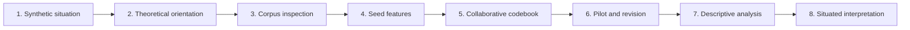

# Protocol: Theory-Informed, Inductive Feature Coding of Synthetic Images

## Purpose

This protocol supports systematic analysis of aesthetic, affective, bodily, compositional, and other visually observable forms of representational power in synthetic images. It connects critical theory with corpus inspection, collaborative codebook development, descriptive analysis, and situated interpretation.

1. Synthetic situation: document the model, interface, prompts, participants, categories, setting, and unknowns.
2. Theoretical orientation: identify concepts that guide attention toward representational power.
3. Corpus inspection: record recurring visible patterns before creating fixed categories.
4. Seed features: develop provisional features with observable visual bases.
5. Collaborative codebook: define, compare, merge, split, revise, retain, or remove features.
6. Pilot and revision: test the codebook on a new sample and document ambiguity.
7. Descriptive analysis: examine occurrence, accumulation, co-occurrence, and contextualised metadata patterns.
8. Situated interpretation: connect visual patterns to theory and the full image-production arrangement.

## Stage 1: Situate the synthetic-image system

### Purpose

Document the technical, social, institutional, textual, and visual conditions through which the corpus was produced.

### Actions

- Identify the model, platform, interface, or installation involved.
- Document dates, locations, participants, users, researchers, curators, and institutions.
- Record prompt templates, defaults, classifications, style instructions, filters, and post-processing where known.
- Record unknown technical details.
- Identify conditions that may shape image style, content, or composition.

### Questions

- Where and when were images produced?
- Who participated in producing, prompting, selecting, curating, or collecting images?
- Which model, version, checkpoint, interface, generation settings, or safety filters were involved?
- Which prompt templates, defaults, demographic categories, or style instructions structured outputs?
- Which aspects of the system remain unknown?
- How might venue, language, accessibility, participation, curation, interface design, or institutional context shape the corpus?

### Documentation to retain

A synthetic-situation map, prompt examples, system documentation, data-provenance notes, and a record of known and unknown conditions.

---

## Stage 2: Establish theoretical orientation

### Purpose

Identify the theoretical traditions and concepts that guide attention toward representational power.

### Actions

- Select relevant readings and concepts.
- State what these concepts direct researchers to notice.
- Record researcher positions and disciplinary assumptions where relevant.
- Distinguish sensitising concepts from code labels.

### Questions

- Which theoretical traditions guide this analysis?
- Which concepts direct attention toward othering, embodiment, gaze, normativity, affect, objectification, visibility, or hierarchy?
- Which concepts were present before corpus inspection?
- Which concepts became more useful through engagement with the corpus?
- How might researchers’ positions shape what they notice or overlook?

### Documentation to retain

A short theoretical-orientation statement and a concept map connecting theory to possible visual questions.

---

## Stage 3: Inspect the corpus inductively

### Purpose

Identify recurring or noteworthy visual patterns before establishing fixed feature categories.

### Actions

- Inspect the full corpus or a documented sample.
- Record visible aesthetic, bodily, gestural, compositional, atmospheric, affective, anomalous, absent, and distorted elements.
- Keep visual description separate from interpretation during initial observation.
- Decide how prompts and metadata will be handled during this stage.

### Questions

- Is the full corpus inspected or a sample?
- How was the sample selected?
- Are prompts visible, hidden, or temporarily set aside?
- Which visual elements recur, appear absent, seem distorted, or receive unusual emphasis?
- Can an observation be described without assigning an emotion, motive, identity, or moral quality to the subject?

### Documentation to retain

Individual observation logs, image identifiers, seed-feature lists, and notes on sampling decisions.

---

## Stage 4: Construct seed features

### Purpose

Translate observations into provisional features with an observable visual basis.

### Actions

- Name candidate features descriptively.
- Identify examples and counterexamples.
- Distinguish strong features from weak or unstable features if this distinction is useful.
- Record uncertainty and adjacent features.

### Questions

- Is the feature visibly identifiable?
- Can it be distinguished from a nearby feature?
- Is it a visual observation or an interpretation of mood, character, motive, or identity?
- Can researchers identify inclusion, exclusion, and borderline cases?
- Should it be merged, split, renamed, retained provisionally, or discarded?

### Documentation to retain

Seed-feature list, examples, counterexamples, and an initial rationale for each candidate.

---

## Stage 5: Develop the codebook collaboratively

### Purpose

Create definitions that other researchers can inspect and apply.

### Actions

- Compare seed features across researchers.
- Discuss overlap, ambiguity, and theoretical assumptions.
- Merge, split, rename, retain, revise, or remove candidates.
- Write definitions, inclusion guidance, exclusion guidance, and borderline notes.
- Document disagreement and decisions.

### Questions

- Does each feature have a clear visual definition?
- Can another researcher recognise it using the written guidance?
- Does the feature overlap with another category?
- Which disagreements require revision, further examples, or removal?
- Which features remain too inferential to code?

### Documentation to retain

A versioned codebook and a decision log.

---

## Stage 6: Pilot and refine

### Purpose

Test the codebook’s clarity, usability, and limitations on a new documented sample.

### Actions

- Apply the provisional codebook to a pilot subset.
- Track overlap, ambiguity, missing cases, uncertainty, and inconsistent application.
- Review difficult cases collectively.
- Revise definitions and record each revision.

### Questions

- Which features produce uncertainty or disagreement?
- Which definitions are too broad, too narrow, or insufficiently observable?
- Which examples or exclusions need to be added?
- Which features should be removed or marked as provisional?
- What supports any claim about consistency of application?

### Documentation to retain

Pilot annotations, revision log, revised codebook, and notes on unresolved ambiguity.

---

## Stage 7: Analyse and interpret

### Purpose

Combine descriptive corpus analysis with close, theory-informed, contextual interpretation.

### Actions

- Calculate feature occurrence, accumulation, and co-occurrence where appropriate.
- Compare features with available metadata cautiously.
- Inspect images and prompts behind numerical patterns.
- Identify meaningful feature constellations.
- Return to theoretical concepts for interpretation.

### Questions

- Which features occur, accumulate, or co-occur?
- Which metadata comparisons are possible and ethically appropriate?
- Which patterns deserve close visual reading?
- Which feature constellations become meaningful through theory?
- Which alternative readings and negative cases remain?

### Documentation to retain

Analysis scripts or calculations, aggregate outputs, image-review notes, and interpretive memos.

---

## Stage 8: Evaluate the synthetic situation

### Purpose

Limit claims to the sociotechnical conditions that produced the corpus.

### Actions

- Revisit system documentation, prompt structures, classifications, user input, and settings.
- Identify possible influences on observed patterns.
- State which conclusions are corpus-specific.
- Identify which method elements may travel to other contexts.

### Questions

- Could a pattern reflect participant input, prompt templates, classifiers, interface design, model architecture, training data, filtering, venue, curation, or post-processing?
- Which causal claims remain unsupported?
- Which conclusions concern this corpus alone?
- Which features, procedures, or documentation practices might be useful elsewhere?

### Documentation to retain

A limitations statement and an explicit account of what can and cannot be claimed.

---
